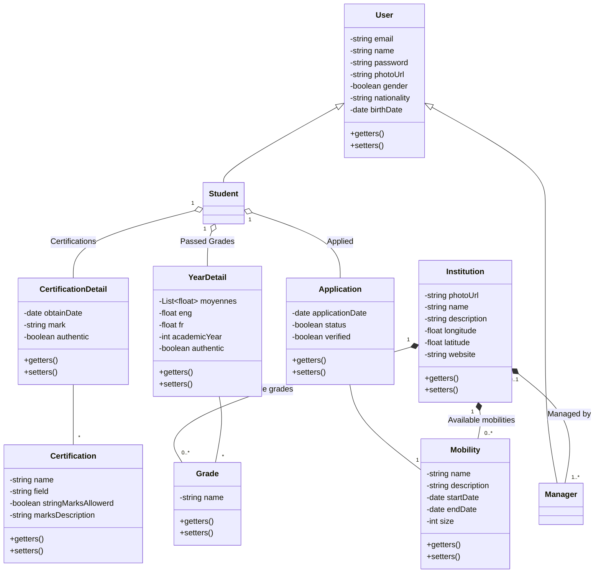

```mermaid
classDiagram

class User {
    -string email
    -string name
    -string password
    -string photoUrl
    -boolean gender
    -string nationality
    -date birthDate
    +getters()
    +setters()
}
class Manager {
    
}
class Student {
    
}

class Institution {
    -string photoUrl
    -string name
    -string description
    -float longitude
    -float latitude
    -string website
    +getters()
    +setters()
}
class Mobility {
    -string name
    -string description
    -date startDate
    -date endDate
    -int size
    +getters()
    +setters()
}
class Certification {
    -string name
    -string field
    -boolean stringMarksAllowerd
    -string marksDescription
    +getters()
    +setters()
}
class CertificationDetail {
    -date obtainDate
    -string mark
    -boolean authentic
    +getters()
    +setters()
}
class Application {
    -date applicationDate
    -boolean status
    -boolean verified
    +getters()
    +setters()
}
class Grade {
    -string name
    +getters()
    +setters()
}
class YearDetail {
    -List~float~ moyennes
    -float eng
    -float fr
    -int academicYear
    -boolean authentic
    +getters()
    +setters()
}

User <|-- Student
User <|-- Manager
Student "1" o-- CertificationDetail : Certifications
Student "1" o-- YearDetail : Passed Grades
Student "1" o-- Application : Applied
Application -- "1" Mobility
Institution "0..1" *-- "1..*" Manager : Managed by
Institution "1" *-- "0..*" Grade : Available grades
Institution "1" *-- "0..*" Mobility : Available mobilities
YearDetail -- "*" Grade
CertificationDetail -- "*" Certification
```